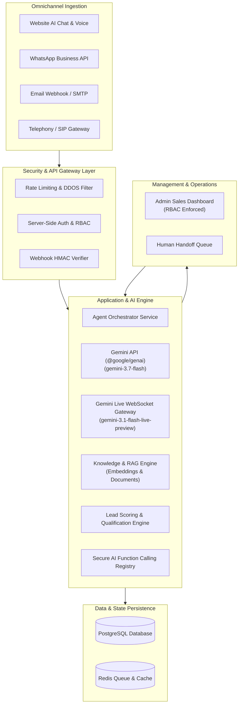

# IMPACT Enterprise AI Sales & Communication Agent — System Architecture

## 1. System Overview
The **IMPACT Enterprise AI Sales & Communication Agent** is a production-grade multimodal sales automation and customer communication platform engineered directly into the [IMPACT Enterprise Website & Client Portal](https://github.com/zaryab124/IMPACT-Enterprise).

The system unifies web chat, inbound/outbound phone calls, WhatsApp messaging, and email into an autonomous conversational sales pipeline powered by Google Gemini, PostgreSQL, Redis, and server-side RBAC.



---

## 2. Existing Repository Baseline (`IMPACT-Enterprise`)

### 2.1 Audited Repository Architecture
- **Repository**: `https://github.com/zaryab124/IMPACT-Enterprise`
- **Framework**: Next.js 14+ (App Router)
- **Language**: TypeScript (Strict Mode)
- **Styling**: Tailwind CSS
- **Visuals Core**: Three.js WebGL 3D dynamic core (`The IMPACT Engine™`)
- **Existing Routes**:
  - `/`: Hero, 3D Canvas, 7-Step AI Agent Workflow, 6-Step Automation Visualization, Idea Builder Scoping Tool
  - `/solutions/ai-agents`: AI & Autonomous Agent Architecture
  - `/solutions/automation`: Business Process Pipelines & CRM Sync
  - `/solutions/software`: Custom Web & Mobile Software
  - `/products`: Proprietary Platforms & MVPs
  - `/projects`: Enterprise Case Studies & Benchmarks
  - `/about`: Philosophy, Problem-First Engineering, Leadership
  - `/contact`: Direct Inquiry Intake
  - `/start-a-project`: Guided 5-Step Scoping Intake Engine
  - `/requests`: Centralized Client Requests & Inquiries Portal with CSV export, WhatsApp, and Email response actions
  - `/api/contact`: Direct contact ingestion
  - `/api/intake`: Project intake ingestion
- **Authentic Leadership & Enterprise Roles**:
  - **Muhammad Zaryab Hassan**: Chief Executive Officer (CEO)
  - **Mahad Aziz**: Chief Growth Officer (CGO)
  - **Muhammad Ismail**: Chief Financial Officer (CFO)
  - **Ansar Abbas Jafri**: Branch Manager (📞 +92 333 6457747)
- **Verified Official Contact Channels**:
  - WhatsApp Direct (HQ): `+92 314 7893907` (`https://wa.me/923147893907`)
  - Branch Operations: `+92 333 6457747` (`https://wa.me/923336457747`)
  - Official Gmail: `impactenterprise527@gmail.com`

---

## 3. Layered Architecture for AI Agent Extensions

### 3.1 Web & Presentation Layer (`app/` & `components/`)
- **Web Chat Widget**: Floating responsive widget rendered across all pages, with streaming tokens, markdown parsing, and conversation state recovery.
- **Realtime Voice Modal**: WebRTC / WebSocket audio visualizer with latency telemetry and mute/interrupt controls.
- **Admin CRM Portal (`app/admin/`)**: Multi-view dashboard for leads, conversations, live telephony logs, calendar bookings, and audit logs.

### 3.2 API & Ingestion Gateway (`app/api/` & `server/`)
- **Health Check**: `GET /api/health` providing database and AI service telemetry.
- **Chat Endpoint**: `POST /api/chat` supporting server-sent streaming responses.
- **Live Voice Gateway**: WebSocket endpoint negotiating ephemeral streaming tokens with Gemini Live API.
- **Webhook Adapters**: `POST /api/webhooks/whatsapp` with HMAC-SHA256 signature verification.
- **Admin APIs**: Protected endpoints requiring valid session tokens and granular permissions.

### 3.3 AI Reasoning & Guardrails (`server/ai/`)
- **SDK**: Official `@google/genai` (Node.js/TypeScript).
- **Models**:
  - `gemini-3.7-flash`: Primary reasoning, tool orchestration, lead scoring, and customer service.
  - `gemini-3.1-flash-live-preview`: Real-time bidirectional voice streaming over WebSockets.
- **Deterministic Guardrails**: Zero-hallucination boundaries. The AI answers exclusively using verified IMPACT Enterprise service documentation. It never promises delivery dates, invents prices, or claims human identity.

### 3.4 Tool Calling Subsystem (`server/tools/`)
The AI engine interacts with data solely through strongly typed backend tools:
1. `search_services()`: Query verified IMPACT service offerings.
2. `search_case_studies()`: Retrieve real portfolio results.
3. `get_company_information()`: Retrieve verified company credentials and contact details.
4. `create_lead()`: Ingest prospect contact and requirement profile into CRM.
5. `update_lead()`: Update lead score, stage, or notes.
6. `get_lead()`: Retrieve prospect context for returning conversations.
7. `book_appointment()`: Check availability and confirm calendar reservation.
8. `send_confirmation()`: Trigger transactional email or WhatsApp notification.
9. `notify_sales_team()`: Alert sales agents for hot leads.
10. `request_human_handoff()`: Safely transition customer to human operator with context summary.

### 3.5 Data Persistence (`server/db/`)
- **Relational Database**: PostgreSQL with migration-controlled schema management.
- **Entities**:
  - `users`, `roles`, `permissions`, `user_roles`
  - `customers`, `companies`, `conversations`, `messages`
  - `leads`, `lead_scores`, `lead_events`
  - `appointments`, `services`, `case_studies`
  - `knowledge_documents`, `knowledge_chunks`, `knowledge_metadata`
  - `agent_sessions`, `agent_actions`, `notifications`, `audit_logs`
- **Cache & PubSub**: Redis for session states, rate limiting, and real-time event broadcasting.

---

## 4. Directory Structure

```
c:\impact enterprise call agent\
├── docs/                     # Architecture, phase specifications, smoke tests, security
│   ├── ARCHITECTURE.md
│   ├── DEVELOPMENT_PHASES.md
│   ├── SMOKE_TESTS.md
│   └── SECURITY.md
├── app/                      # Next.js App Router (pages and API routes)
│   ├── (public routes)       # Existing live routes: /, /about, /contact, /solutions, /projects
│   ├── requests/             # Centralized Client Requests & Inquiries Portal
│   ├── admin/                # Protected Admin CRM Portal (Phase 14)
│   ├── api/                  # API endpoints (/api/health, /api/chat, /api/contact, /api/intake)
│   ├── globals.css           # Global Tailwind and brand animations
│   └── layout.tsx            # Global layout with header, navigation & chat widget
├── components/               # UI components
│   ├── brand/                # IMPACT Enterprise logos, badges
│   ├── conversion/           # Idea Builder, Intake forms
│   ├── home/                 # Hero, Engine showcase, Benchmarks, Workflows
│   ├── layout/               # Header, Navbar, Footer
│   ├── visuals/              # Three.js 3D Canvas, Telemetry monitors
│   ├── chat/                 # AI Sales Chat Widget & Voice Visualizer (Phase 6 & 11)
│   └── admin/                # CRM tables, charts, lead pipelines, handoff queues (Phase 14)
├── data/                     # In-memory and local JSON backup stores
│   ├── inquiries.json        # Contact inquiries
│   └── intake_submissions.json # Project intake submissions
├── server/                   # Server-side core services (strictly non-browser)
│   ├── ai/                   # Gemini client, prompt engineering, agent orchestration
│   ├── auth/                 # Password hashing, JWT/session issuance, RBAC checks
│   ├── db/                   # PostgreSQL pool, queries, migrations
│   ├── tools/                # AI function calling tool registry
│   ├── channels/             # Channel adapters (Web, WhatsApp, Email, Phone)
│   ├── crm/                  # Lead qualification & scoring pipeline
│   └── audit/                # Security audit logging service
├── public/                   # Static branding, 3D assets, logos
├── .env.example              # Documented environment template
├── .gitignore                # Airtight secret and artifact exclusions
├── package.json              # Dependencies and scripts
├── tsconfig.json             # TypeScript configuration
└── tailwind.config.ts        # IMPACT Enterprise design theme tokens
```

---

## 5. Security Safeguards
1. **Zero Secret Exposure**: `GEMINI_API_KEY` and database credentials exist exclusively in server environments. No client-side bundle or browser network request ever receives raw keys.
2. **Deterministic Sales Behavior**: Standardized lead scoring rules (0-100) evaluate business fit, clarity, budget, timeline, and decision-making authority before progressing stages.
3. **No Fake Functionality**: Any external provider downtime (e.g. WhatsApp or Twilio) immediately produces explicit error handling and queueing rather than synthetic confirmations.
